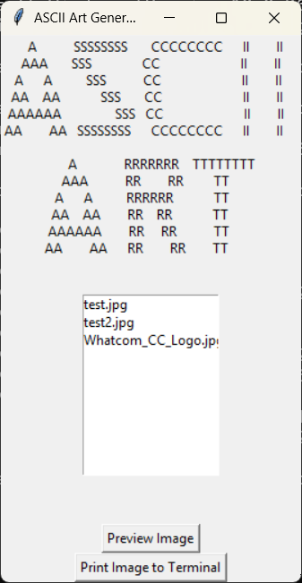

## ASCII Art Generator

This program prints out ASCII art of an image.

## Program Description

From a GUI the user may preview an image and print it to the terminal. You will likely have to zoom out (Ctrl and -) in the terminal to view the ASCII art properly 

